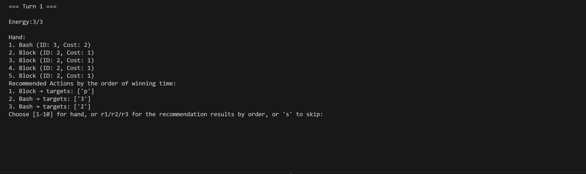

# Deck Battle Sim

This is a lightweighted, unofficial, personal project inspired by the game Slay the Spire. It reproduces a small part of the original mechanics and assets (mainly names). In this project I have built:
- A Slay-the-Spire-style Gym environment for single-combat battles. The folder `/envs` contains implementations of player, hand management, card effects, enemies intents and also a simple battle demonstrator--all in Python and easy to use for simulation or extension;
- A mass simulation and dataset generation script. The `/sim/simulate_battle.py` can run thousands of self-play battles using user-defined deck and enemy_group from `/data/deck.json` and `/data/enemy_group.json`. It logs per-turn state, action, and outcome as JSON lines to `/experiments`.
- A simple recommendation model for analysing simulation data. In each turn rank every card based on their estimated chances of winning the battle. The file is in `/model/stat_recommendsys.py`.
- A human playable demo embedded with recommendations. In `/tests/battle_with_recommend.py` you can play through a battle interactively in the terminal. When playing the same setup as in simulations, the stats-based recommender suggests the best card-target combination to maximize your win rate, letting you directly compare your decisions with the automated strategy.


---

### Usage
```bash
# Install
git clone https://github.com/willweiao/Deck-battle-sim-demo.git
cd deckbattle-sim-demo
pip install -r requirements.txt 
```
1. build your deck
in `/data/deck.json` you can pick or customize your deck with cards in `/data/card.json`
```bash
# deck like this:
{
    ...
    "deck30":{
        "name":"My_favourate_deck",
        "cards":["1",...]                // enter card's id here
    },
    ...
}
```
2. choose your enemy
in `/data/enemy.json` and `/data/enemy_group.json` you can find the enemies you want fight. You might need to form a enemy group even if there's only one enemy.
```bash
{
    ...
    "group77":{
        "name":"My_enemy_group",
        "enemy_ids":["1",...]
    }
}
```
3. replace the default deck and enemy
You can find the default entries here in `/sim/simulate_battle.py`
```bash
run_simulation(
        deck_json_path=deck_json_path,
        deck_id="deck06",                             # <-- replace with your own deck_id
        enemygroup_json_path=enemygroup_json_path,
        enemygroup_id="group04",                      # <-- replace with your own enemygroup_id
        num_simulations=1000
    )
```
and run it. Then replace the code here in `/tests/battle_with_recommend.py`
```bash
if __name__ == "__main__":
    examine_experiment_json = "basic_vs_Slime_Duo.json"                # <-- replace here to the simulated battle 
    base_dir = os.path.abspath(os.path.join(os.path.dirname(__file__), ".."))
    examine_path = os.path.join(base_dir, "experiments", examine_experiment_json)
    
    action_stats = generate_action_stats(examine_path, only_wins=True)  # gather the complete stat form 

    deck_path = os.path.join(base_dir, "data", "deck.json")
    enemy_path = os.path.join(base_dir, "data", "enemy_group.json")

    card_pool = load_card_pool("card.json")
    deck, _ = load_deck_by_id(deck_path, "deck01", card_pool)           # <-- must use the same deck as in the simulation
    enemies_template, _ = load_enemy_group(enemy_path, "group01")       # <-- same, need to comfront the same enemy as in the sim
    enemies = [e for e in enemies_template]
```

---

### More
1. This project is a simplified combat model inspired by Slay the Spire. Only a small subset of cards and enemies are implemented, and the relics and potions systems are entirely omitted. As a result, this model does not aim to be a full replica of the real Slay the Spire game.
2. For simplicity, several features are implemented in an easier way. For example, the `"target-selector"` is attached directly to each `Card` object, rather than assigning a separate `"target-selector"` to every `CardEffect` as would be more correct. This design decision was made early on and, since it doesn’t affect core functionality, was left unchanged.
3. By building a Gym environment for the game in Python, you can run thousands of simulations quickly and generate compact battle log datasets. It's easy for users to contribute by adding more cards and enemies, and the datasets can be used for further experiments, such as training supervised learning models etc.